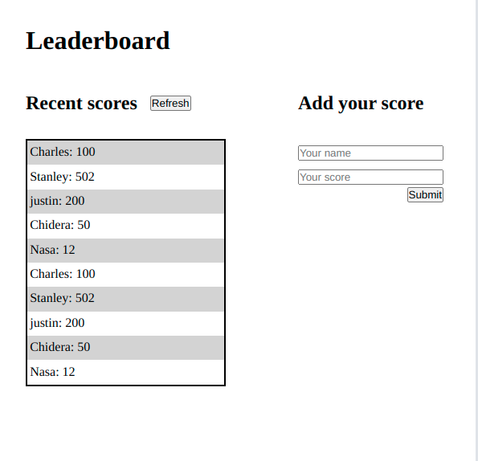

# Leaderboard

> Leaderboard is a webapp where user can maintain a list of anmes and scores in a game.

## Built With

- HTML
- Css
- JavaScript

## Live Demo (if available)

[Live Demo Link](https://chukwuebukavictor.github.io/Leader-board/dist)

## Getting Started
To get a local copy up and running follow these simple example steps.

### Prerequisites
- Get a github account
- Install gitbash 
- Use your favorite IDE 

### Setup
- Clone this GitHub repository [link](https://github.com/chukwuebukaVictor/Leader-board) to your local machine.
- CD into folder name.
- On the terminal, run "npm install" to install the dependencies.
- Finally, run "npm start" to open the app in your Web Browser.

## Authors
👤 **Chukwuebuka Victor Ozoede**

- GitHub: [@githubhandle](https://github.com/chukwuebukaVictor)
  
  ## 🤝 Contributing

Contributions, issues, and feature requests are welcome!

Feel free to check the [issues page](https://github.com/chukwuebukaVictor/Leader-board/issues).

## Show your support

Give a ⭐️ if you like this project!

## Acknowledgments

- Thanks to Microverse for the guidelines for this project.
